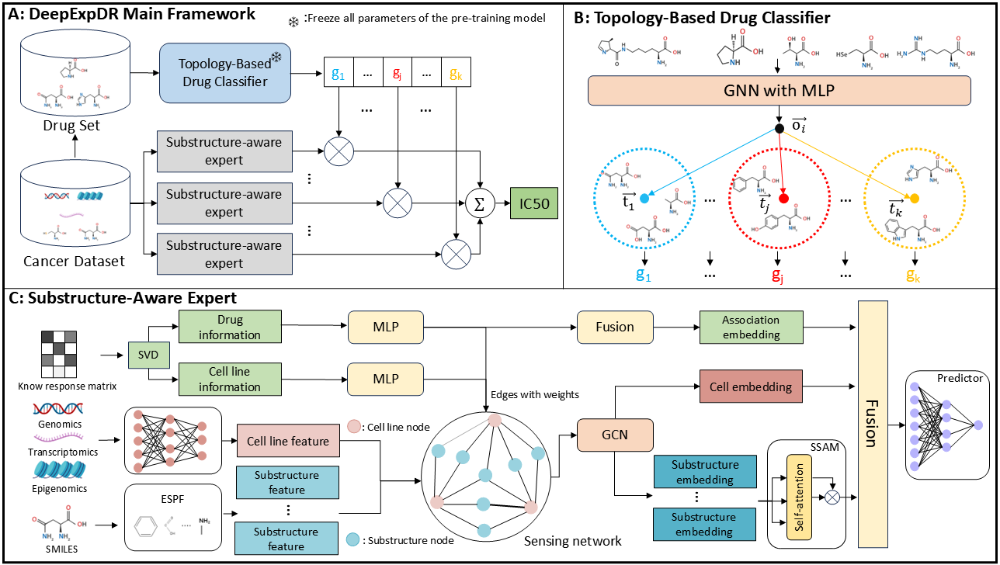

# DeepExpDR
=======
# DeepExpDR
DeepExpDR: Drug Response Prediction through Molecular Topological Grouping and Substructure-aware Expert

## Architecture

## Overview 
We present DeepExpDR, a deep expert framework designed for drug response
prediction. We first pre-train a self-supervised clustering model to group drugs based on
molecular scaffold similarities, and then assign each drug group to a specialized substructure-
aware expert. Each expert incorporates a substructure sensing network, which extracts drug
response information from substructure sequences, cancer cell transcriptional gene expression
values, and drug response correlation matrices. Finally, the predicted responses from experts
are weighted summed to generate the final IC50 value.

## Data
'data/Binary_class' : All the data needed for the classification experiment, including warm setting and cold setting

'data /bulk': All the data needed for the regression experiment, including warm setting and cold setting

'data /CDR_Matrix': Drug response information matrix of cancer dataset

'data/substructure_data': Drug substructures store information

'data/drug_smiles.csv': Drug Smiles sequence information

'data/unique_cells.csv': Cancer cell line name information in the database

'data/unique_drugs.csv': Drug name information in the database

## Environment
`You can create a conda environment for DeepExpDR  by ‘conda env create -f environment.yml‘.`

## Train and test
- ### step 1
  - #### pre-trian Topology-Based Drug Classifier
        'python classify_drugs.py'
- ### step 2 (regression experiment):
  - #### warm setting
        `python main_test.py`
  - #### cold setting for cancer cell
        `python main_cell_leave.py`
  - #### cold setting for drug
        `python main_drug_leave.py`
- ### step 2 (classification experiment):
  - #### warm setting
        `python main_test_classify.py`
  - #### cold setting for cell
        `python main_cell_leave_classify.py`
  - #### cold setting for drug
        `python main_drug_leave_classify.py`
